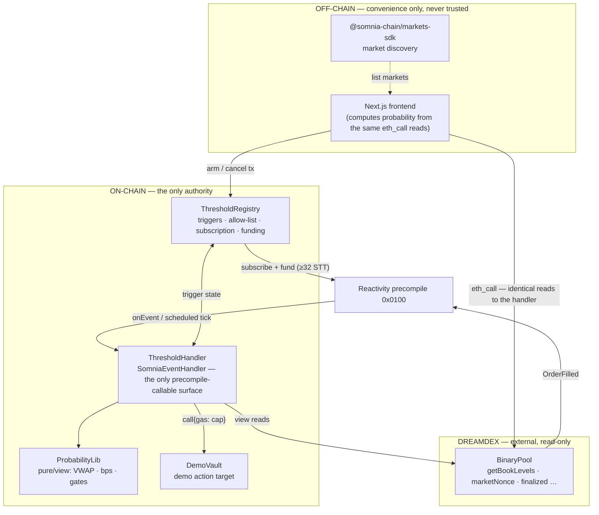

# Threshold

> Probabilistic automation for DreamDEX Event Contracts.

**A smart contract that acts on what a market *believes will* happen — before it happens.**

Threshold turns a DreamDEX binary Event Contract's price into an on-chain probability sensor. When
that probability crosses a line you set **and holds there**, your contract fires an action. No keeper,
no bot, no off-chain watcher — the contract wakes itself.

Built for the Somnia × DreamDEX Event Contracts Hackathon.

| | |
|---|---|
| **Live app** | https://getthreshold.vercel.app |
| **Pitch Slides** | https://gamma.app/docs/Threshold--kre9t2545gavi4n |
| **Network** | Somnia Shannon testnet (chain `50312`) |
| **First autonomous execution** | [`0x92e6717d…6dea`](https://shannon-explorer.somnia.network/tx/0x92e6717dbcc424f2e1a6d94442609b60b98e88146f87dbd4a3826c602ea96dea) — `from` is the Registry contract, no EOA in the loop |

---

## The problem

**Every automation primitive on-chain fires on a fact that has already happened.**

A keeper polls a price feed and submits a liquidation *after* the position is already underwater. A
stop-loss executes *after* the drop. A governance timelock releases *after* the vote. The entire
on-chain automation stack is structurally reactive — it observes a completed state transition and
responds to it. By the time the transaction lands, the loss is taken, the opportunity is gone, or the
damage is done.

Acting *earlier* — on what is **likely** rather than what is **certain** — has never had a
trustworthy on-chain primitive. The options were:

- **An off-chain model.** Some server runs a forecast and submits a transaction when its number
  crosses a threshold. No contract can verify the model. Its operator loses nothing by being wrong,
  turning it off, or lying. This is the thing decentralised systems exist to avoid.
- **An oracle.** Oracles report measured facts (a price, a temperature, an election result once
  it's called). They do not report *forward-looking probability*, and the moment they could, they'd
  face the same "who computed this and why should I trust them" problem.

So contracts wait for certainty, and certainty arrives late.

## The solution

**A DreamDEX binary Event Contract's mid-price is already a forward-looking probability — and it's
already on-chain.**

A binary market on "Will BTC be above $X at 16:00?" trades between 0 and 1. Its mid-price is the
market's collective, capital-weighted estimate of that event's probability, refreshed on every
order, maintained by participants who **lose money when they're wrong**. It is the closest thing
crypto has to a verifiable, adversarially-maintained probability feed.

Threshold treats that price as a **sensor, not a betting venue.** It provides:

1. A registry where anyone arms a **trigger**: *"call `target.selector()` when P(YES) on this market
   crosses `X%` in direction `D` and stays there for `T` seconds."*
2. A handler that is invoked automatically — by Somnia's Reactivity precompile, on every fill on the
   watched pool — which **re-reads the order book on-chain**, computes a manipulation-resistant
   probability, checks eight validity gates, and dispatches the action when the condition has
   *persisted*.
3. A frontend that computes the exact same probability from the exact same on-chain reads, so what a
   user sees is what the contract will act on.

No keeper runs this. The Registry funds its own Reactivity subscription and the handler schedules
its own follow-up evaluation. Remove every off-chain machine and the system still fires.

## Why it matters

Threshold is a general trigger source. Anything a market can price, a contract can now act on *ahead
of the event*:

| Domain | Today (reactive) | With Threshold (anticipatory) |
|---|---|---|
| **Treasury / DAO** | De-risk after a depeg is confirmed | De-risk when the market's probability of a depeg crosses 60% and holds |
| **Lending** | Liquidate after the oracle price breaches | Begin unwinding when the market believes a breach is likely within the hour |
| **Protocol ops** | Pause after an exploit is on-chain | Pause when a market on "Will protocol X be exploited this week?" spikes |
| **Structured products** | Settle on the realised outcome | Roll or hedge on the market-implied outcome, before expiry |
| **Insurance** | Manual claims after the event | Auto-payout when the belief threshold is sustained |

The mechanism is the contribution: **on-chain systems can now condition execution on
market-consensus expectation**, with the same trust properties as reading any other contract's
state, and with no new off-chain dependency.

## How it works

```
   a trader fills an order on the watched BinaryPool
                     │
                     ▼
        OrderFilled event  ──────────────►  Somnia Reactivity precompile (0x0100)
                                                        │  invokes (no keeper)
                                                        ▼
                                              ThresholdHandler.onEvent
                                                        │
              ┌─────────────────────────────────────────┤
              ▼                                          ▼
   re-read the order book on-chain            gates G1–G8  (identity, liveness,
   getBookLevels(bid,8) / (ask,8)              two-sidedness, spread, depth …)
   getBinaryPoolParams / marketNonce                     │  all must pass
              │                                          ▼
              ▼                             depth-weighted P(YES) across ≤8 levels/side
   ┌──────────────────────────────────────────────────────────────────┐
   │  qualified?    →  no  → reset dwell, stay ARMED                   │
   │  qualified?    →  yes → start / keep dwell timer (→ OBSERVING)    │
   │  held ≥ dwellSec (re-validated) → dispatch                        │
   └──────────────────────────────────────────────────────────────────┘
              │
              ▼
   target.call{gas: cap}(selector ‖ payload)      ← allow-listed (target, selector) only
              │                                     call only, never delegatecall, no value
              ▼
   emit TriggerExecuted(id, probabilityBps, success, returndataHash)
```

Step by step:

1. **Arm.** A user picks a live market in the UI, sets threshold / direction / dwell / minimum depth
   / action, and sends **one transaction** to `ThresholdRegistry.createTrigger`. The registry reads
   the pool's `marketNonce()` and **pins it** into the trigger. If this is the first trigger on that
   pool, the registry opens a Reactivity subscription on the pool's `OrderFilled` topic.
2. **Wait.** Nothing runs. The trigger sits `ARMED`.
3. **A fill happens.** Any trader trading that market emits `OrderFilled`. The precompile calls
   `handler.onEvent(pool, topics, data)`. The event payload is treated as a **wake-up only** — the
   handler never reads `fillPrice` from it.
4. **Evaluate.** The handler re-reads the book on-chain, runs gates G1–G8, computes the
   depth-weighted mid, and compares it to the threshold. If it qualifies, the dwell timer starts and
   the trigger moves to `OBSERVING`. The handler also schedules **one** time-based follow-up tick at
   the dwell's end, so the trigger is still evaluated even if the market goes silent.
5. **Persist.** On subsequent fills (and the scheduled tick), every gate and the threshold are
   re-checked. If the signal slips back across the line, the dwell resets. If it holds for the full
   `dwellSec`, the handler dispatches the action.
6. **Execute.** `target.call{gas: actionGasCap}` inside `try/catch`. One bad or gas-griefing target
   can't block the other triggers on that pool. `TriggerExecuted` is emitted whether the call
   succeeded or reverted, so a silent failure is impossible.

## Architecture



**The invariant that defines the design:**

> No off-chain component can *cause* a trigger to execute, and no off-chain component can *prevent* a
> trigger from executing.

The frontend exists only so the user sees the same number the handler will act on. If they ever
disagree, the handler is right and the UI has a bug — which is why the probability algorithm is
implemented twice (Solidity + a TypeScript port) and pinned together by parity tests.

**Registry and Handler are separate contracts** on purpose: the handler's `onEvent` is
precompile-callable and is kept as small and as unable-to-brick-state as possible; the registry holds
the value, the permissions, and the subscription.

## Technical implementation

Solidity `0.8.30` · Foundry · Next.js 14 · wagmi v2 · viem v2 · Tailwind. No backend, no database,
no indexer, no keeper.

### The probability engine

`ProbabilityLib` is a pure/view library. It reads a binary pool's book **once** into a snapshot
(up to 8 `{priceBps, notional}` levels per side plus liveness flags) and derives:

- **`P(YES) = yesPrice / oneCollateral`**, stored everywhere as **basis points** (`uint16`, `[0,
  10000]`) — fixed-point, no floats. `oneCollateral` is `1e6` on Shannon and `1e18` on mainnet and
  is **always read from the pool**, never hardcoded.
- **Depth-weighted mid** — the signal Threshold actually acts on. Walk each side accumulating
  notional (`price × quantity / oneCollateral`) until it reaches `minDepthPerSide`, take the
  notional-weighted average price of the consumed levels, average the two sides:

  ```
  vwapUntil(levels, target):
      acc = 0; notional = 0
      for (price, qty) in levels:            # ≤ 8 levels
          n = price * qty / oneCollateral
          acc += toBps(price) * n
          notional += n
          if notional >= target: break
      return (acc / notional, notional)

  midBps = (vwapUntil(bids, minDepth).vwap + vwapUntil(asks, minDepth).vwap) / 2
  ```

  **Why this is the manipulation guard.** A single aggressive fill against a stale quote moves the
  *last trade price* and can momentarily nudge the *touch*. It does **not** move a notional-weighted
  average across eight levels — clearing one thin level leaves the rest dominating the mean. To
  actually move the depth-weighted mid you must clear real size across the book, against every
  arbitrageur, and *hold it there for the entire dwell*. That is indistinguishable from a genuine
  repricing.

- A **confidence score** (spread + staleness penalty) shown in the UI as a 0–100 bar and **never
  used in the on-chain decision** — a scalar that silently blends independent failure modes is worse
  than explicit gates.

Overflow is handled: a hostile pool returning an absurd `quantity` saturates the notional to
`uint128.max` instead of reverting the whole callback (found by fuzzing, 10k runs).

### The eight gates

Evaluated on-chain inside the callback, cheapest-and-most-likely-to-fail first. **All must pass**
before the threshold is even compared:

| # | Gate | Reads | Rejects when |
|---|---|---|---|
| G1 | Trigger armed | storage | state ∉ {ARMED, OBSERVING} |
| G2 | **Market identity** | `marketNonce()` | `≠ trigger.pinnedNonce` — *the pool was recycled onto a different market* |
| G3 | Not finalized | `finalized()` | true |
| G4 | Not expired | `marketExpiryNs()` | `block.timestamp·1e9 ≥ marketExpiryNs` |
| G5 | Book present | `booksEmpty()` | true |
| G6 | Two-sided | top of book | bid or ask side missing — a one-sided book has no meaningful mid |
| G7 | Spread | computed | `spreadBps > trigger.maxSpreadBps` |
| G8 | Depth | `getBookLevels` | either side below `trigger.minDepthPerSide` |

**G2 is the gate nobody else has.** DreamDEX BinaryPools are *recycled* — a `PoolRecycled` event
re-points a pool address at a fresh market with an incremented nonce. A Reactivity subscription is
bound to the pool *address*, which outlives the market. Without pinning `marketNonce` at arm time, a
trigger armed on the 14:00 BTC window would silently fire on the 14:05 window's book. Threshold pins
it and lets the trigger **expire** rather than act on the wrong market.

Every gate is re-checked **at dispatch time**, not only when the dwell started. A trigger must not
survive on a book that went thin after it started observing.

### Dwell — the persistence guard

A threshold crossing is not a signal; a *sustained* crossing is. Each trigger carries `dwellSec`.

```
qualified(p) := (direction == ABOVE && p >= thresholdBps)
             || (direction == BELOW && p <= thresholdBps)
```

| State | qualified | transition |
|---|---|---|
| ARMED | false | no-op |
| ARMED | true | `dwellStart = now`; → **OBSERVING**; schedule dwell-expiry tick |
| OBSERVING | false (or any gate fails) | `dwellStart = 0`; → **ARMED** (dwell reset) |
| OBSERVING | true, `now − dwellStart < dwellSec` | keep observing |
| OBSERVING | true, `now − dwellStart ≥ dwellSec` | → dispatch → **EXECUTED** |

`EXECUTED`, `EXPIRED`, `CANCELLED`, `FAILED` are terminal. `EXPIRED` is how a nonce-mismatch or a
past-deadline trigger ends — dead, never fired.

### No keeper: the Reactivity integration

Two mechanisms, both entirely on-chain:

1. **Event-driven.** `ThresholdRegistry` calls `SomniaExtensions.subscribe` to bind the handler to a
   specific pool's `OrderFilled` topic, filtered on `emitter = <that pool>`. Every fill on that
   market invokes `handler.onEvent`. The registry is the subscription owner and **must hold ≥ 32
   STT** — `SUBSCRIPTION_OWNER_MINIMUM_BALANCE` is checked against the *calling* contract's balance —
   so the registry funds itself and `withdrawSurplus` can never take it below that floor (invariant
   I9).

2. **Time-driven fallback.** If the probability crosses the line and then the market goes silent, no
   fill means no callback, and a naive design would leave the trigger silently dead through its
   entire dwell. When a trigger enters `OBSERVING`, the handler calls
   `scheduleSubscriptionAtTimestamp` (via the registry — that call also checks the *caller's* 32-STT
   balance) to schedule **one** tick at the latest dwell-end among triggers that started observing in
   that callback. That tick re-evaluates *every* trigger on *every* subscribed pool, so a shorter
   concurrent dwell is still covered, and callback gas stays bounded (measured: ~597k for 16
   triggers). If the schedule call fails it emits `DwellExpiryScheduleFailed` and degrades to
   fill-driven rather than reverting the callback.

The [first autonomous execution](https://shannon-explorer.somnia.network/tx/0x92e6717dbcc424f2e1a6d94442609b60b98e88146f87dbd4a3826c602ea96dea)
was fired by exactly this scheduled tick: `TriggerExecuted(id=3, probabilityBps=4490, success=true)`,
transaction `from` = the Registry contract, `to` = the Handler. No EOA, no bot, anywhere in the
trace.

### Security model

Ten invariants, each with a test:

| | Invariant |
|---|---|
| I1 | Only `0x0100` can invoke `ThresholdHandler.onEvent` |
| I2 | A trigger executes at most once per `(triggerId, dwell cycle)` |
| I3 | A trigger never executes while `marketNonce ≠ pinnedNonce` |
| I4 | A trigger never executes when any of G3–G8 fails at dispatch time |
| I5 | A trigger's action is a `(target, selector)` pair on the admin allow-list — nothing else |
| I6 | No user data reaches an external call except as `payload` bytes after an allow-listed selector |
| I7 | A reverting / gas-griefing target cannot stop other triggers evaluating |
| I8 | Only a trigger's owner can cancel it; only the handler can mutate its state |
| I9 | The registry balance never drops below 32 STT via `withdrawSurplus` |
| I10 | No off-chain component can cause or prevent an execution |

**Arbitrary-target execution is the highest-severity risk** and is contained on multiple sides:

- Admin-curated `(target, selector)` **allow-list**. Users choose an allow-listed action; they do
  not supply arbitrary targets.
- `selector` is stored separately from `payload`, so a user cannot swap in a different function.
- Explicit denylist: `target` may not be the registry, the handler, the precompile, or the zero
  address.
- **`call` only — never `delegatecall`, never `selfdestruct`, no value forwarded.**
- `actionGasCap ≤ 2_000_000` (Shannon's gas schedule runs ~10× a mainnet equivalent; the effective
  action budget is conservative). The per-pool trigger loop is bounded at 16.
- For the demo, `DemoVault.derisk()` is the only allow-listed action and `DemoVault` itself requires
  `msg.sender == handler`. Defended on both sides.

**Effects before interactions**, always. Custom errors, not revert strings. An event on every
`onEvent` entry — a silent callback failure would otherwise be undiagnosable.

### On-chain / off-chain split

| | On-chain (authority) | Off-chain (convenience) |
|---|---|---|
| Trigger state & lifecycle | ✅ | |
| Probability & gate evaluation | ✅ | mirrored for display |
| Execution | ✅ | |
| Market discovery | | ✅ (`listBinaryMarkets`) |
| Preview / "would this fire now?" | | ✅ (`eth_call` + TS port) |

The frontend calls the **same** `getBookLevels` / `getBinaryPoolParams` / `marketNonce` via
`eth_call` and runs `web/lib/probability.ts` — a line-for-line port of `ProbabilityLib`. They are
locked together by parity tests (`contracts/test/parity/Parity.t.sol` and
`web/lib/probability.test.ts`) that feed byte-identical fixtures to both engines and assert identical
output (e.g. a thin-top-over-a-gap book → `midBps == 5193` on both sides). It never reads probability
from the REST indexer, which lags the chain by seconds.

## The contracts

| Contract | Responsibility |
|---|---|
| **`ThresholdRegistry`** | Trigger CRUD, ownership, `(target, selector)` allow-list, pool→subscription mapping, subscription funding, emergency stop. Holds all value and permissions. |
| **`ThresholdHandler`** | `SomniaEventHandler` subclass — the only precompile-callable surface. Receives callbacks, evaluates gates + probability, advances state, dispatches actions. Deliberately minimal. |
| **`ProbabilityLib`** | `library`, pure/view. Snapshot, VWAP, bps conversion, gate logic. Unit-testable in isolation and ported to TypeScript for the UI. |
| **`DemoVault`** | Demo action target. `deposit()` / `derisk()` / `reset()`. Only `ThresholdHandler` may `derisk()`. |
| **`IBinaryPool`** | Minimal read interface into DreamDEX: `getBookLevels`, `getBinaryPoolParams`, `marketNonce`, `finalized`, `booksEmpty`, `marketExpiryNs`. |

Key constants: `MAX_LEVELS = 8`, `MAX_TRIGGERS_PER_POOL = 16`, `MAX_ACTION_GAS = 2_000_000`,
`MIN_SUBSCRIPTION_BALANCE = 32 ether`.

## Deployment

Somnia Shannon testnet (chain `50312`). All contracts verified on the
[Shannon explorer](https://shannon-explorer.somnia.network) (Blockscout).

| Contract | Address |
|---|---|
| ThresholdRegistry | [`0xb31014A95Da14e94900a5b8c58087E8f754e596d`](https://shannon-explorer.somnia.network/address/0xb31014A95Da14e94900a5b8c58087E8f754e596d?tab=contract) |
| ThresholdHandler | [`0x693DC66E334674d5FF1ECf846d64E5086187195e`](https://shannon-explorer.somnia.network/address/0x693DC66E334674d5FF1ECf846d64E5086187195e?tab=contract) |
| DemoVault | [`0xcAc26cFD38d72F8730dEFA46a271D055246a1463`](https://shannon-explorer.somnia.network/address/0xcAc26cFD38d72F8730dEFA46a271D055246a1463?tab=contract) |

**First autonomous execution:**
[`0x92e6717d…6dea`](https://shannon-explorer.somnia.network/tx/0x92e6717dbcc424f2e1a6d94442609b60b98e88146f87dbd4a3826c602ea96dea)
— `TriggerExecuted(id=3, probabilityBps=4490, success=true)`, sent from the Registry by the
Reactivity precompile's scheduled tick, with no transaction sent to the target by anyone. Several
more executions have fired since.

### DreamDEX protocol (CREATE3 — identical addresses on both chains)

| | |
|---|---|
| BinaryMarketsModule | `0x3ecC694Cef705358864a646142ac17A90E29e388` |
| MarketsCore | `0x2802504314685D89bF6C992CA5a8e7cC78bc0294` |
| BinarySettlement | `0xbF4a49e0Dfd092e5FBE8E5761064C49533e6Ed23` |
| OracleHub | `0xe40db387cC98601Dd11bd634fF2f3AD5686dE32b` |
| TestUSDC (Shannon, 6 dp) | `0x70a86D8842FB63C4Ad2b7cdddF530eBf1BB25d8E` |

See [`docs/13-deployment.md`](docs/13-deployment.md) for the full procedure (including Shannon's
~10× gas schedule, which forces per-contract `forge create --legacy` instead of a batched script).

## The frontend

`web/` — Next.js 14 App Router, deployed at **https://getthreshold.vercel.app**.

| Route | What it does |
|---|---|
| `/` | Dashboard — registry balance, your triggers, watched pools, live market count |
| `/markets` | Live binary markets with P(YES) re-derived on-chain every poll |
| `/markets/[id]` | One market: probability gauge, 8-level order book, live **Gate check** panel (G1–G8), the pool's triggers |
| `/triggers/new` | Arm a trigger — threshold, direction, dwell, min depth, action — with a "would this fire right now?" preview |
| `/triggers/[id]` | A trigger's belief→threshold→action panel, dwell ring, execution card with both block numbers |
| `/demo` | The DemoVault's risky/safe balances and a live `TriggerExecuted` stream from the handler |
| `/docs` | The mechanism, the eight gates, deployed addresses, limitations |

Reads go through a same-origin RPC proxy (`/api/rpc`) so the browser never hits the public RPC's
per-client rate limit. Market discovery reads pool state directly over RPC — no indexer dependency.

## Running it locally

Requires Foundry, Node 20+, pnpm.

```bash
git clone <repo> && cd threshold
pnpm install

# contracts
cd contracts && forge build && forge test && cd ..

# frontend
cp .env.example web/.env.local     # fill in per docs/17-environment-variables.md
pnpm --filter web dev              # http://localhost:3000
```

Add Shannon to your wallet — RPC `https://api.infra.testnet.somnia.network`, chain id `50312`,
symbol `STT` — and get testnet STT from https://testnet.somnia.network.

## Testing

```bash
cd contracts
forge test                                     # 99 tests
forge test --match-test 'test_A'                # the adversarial suite (A1–A14)
forge coverage --report summary

cd ../web
pnpm test                                      # TS probability port vs Solidity, same fixtures
```

**99 tests, all passing.** Line coverage: `DemoVault` 100%, `ProbabilityLib` 100%, `ThresholdHandler`
97.6%, `ThresholdRegistry` 99.2%. Fuzz tests run at 10k runs under the CI profile.

The adversarial suite is what proves the design is real, not the happy-path tests:

| | Proves |
|---|---|
| A1 | The subscription binds to the pool's real `OrderFilled` topic — a spoofed event from another contract can't wake the handler |
| A4 | A thin level cleared by an aggressive fill does **not** move the depth-weighted mid past the gates |
| A5 | A probability oscillating across the threshold never executes — the dwell keeps resetting |
| A6 | A scheduled tick arriving in the same block as a fill is a no-op for an already-terminal trigger |
| A7 | A trigger on a recycled pool moves to `EXPIRED` instead of firing on the new market (G2) |
| A8 | A reverting target does not block the other triggers on the pool (I7) |
| A9 | An unbounded-gas target is capped and isolated; a sibling trigger on the same callback still executes |
| A12 | A market that expires mid-dwell moves the trigger to `EXPIRED` — no execution, stays dead through further fills |

## Limitations — stated plainly

- **Testnet only. Not audited. Do not deploy as-is.**
- **Manipulation is reduced, not eliminated.** On a genuinely illiquid market, an attacker with
  enough capital can hold a manipulated price through the dwell. `minDepthPerSide` must be set
  relative to the value of the action it guards — the deeper the required book, the more real capital
  an attack costs.
- **Arbitrary-target execution is admin-allow-listed**, not user-open. A production version needs a
  vetting process or a permissionless-but-sandboxed action model.
- **Subscription funding is a shared resource.** One registry funds all subscriptions from one
  balance. Production needs per-user funding or rate limits so one user can't drain it.
- **Same-block execution is not claimed.** The action fires on the scheduled dwell-expiry tick,
  seconds after the qualifying fill — automatically, with no keeper, but not atomically.
- Anything still marked `NEEDS VERIFICATION` in [`docs/02`](docs/02-technical-research.md) is
  disclosed there rather than hidden.

## Repository layout

```
contracts/          Foundry project — Solidity 0.8.30
  src/              Registry, Handler, ProbabilityLib, DemoVault, interfaces
  test/             unit / adversarial / parity / fuzz  (99 tests)
web/                Next.js 14 frontend — deployed to Vercel
  lib/probability.ts   line-for-line TS port of ProbabilityLib
scripts/            PHASE 0 verification harness + deploy/demo scripts
docs/               00–18, numbered, read in order
```

- [`00`](docs/00-project-overview.md) overview · [`01`](docs/01-product-requirements.md) requirements · [`02`](docs/02-technical-research.md) **technical audit** · [`03`](docs/03-architecture.md) architecture · [`04`](docs/04-smart-contracts.md) contracts
- [`05`](docs/05-reactivity.md) **reactivity** · [`06`](docs/06-dreamdex-integration.md) DreamDEX integration · [`07`](docs/07-probability-engine.md) **probability engine** · [`08`](docs/08-trigger-engine.md) trigger engine · [`09`](docs/09-frontend.md) frontend
- [`10`](docs/10-backend-indexing.md) backend (none) · [`11`](docs/11-security.md) **security** · [`12`](docs/12-testing.md) testing · [`13`](docs/13-deployment.md) deployment · [`14`](docs/14-demo-script.md) demo
- [`15`](docs/15-hackathon-submission.md) submission · [`16`](docs/16-claude-code-build-plan.md) build plan · [`17`](docs/17-environment-variables.md) env · [`18`](docs/18-troubleshooting.md) troubleshooting
