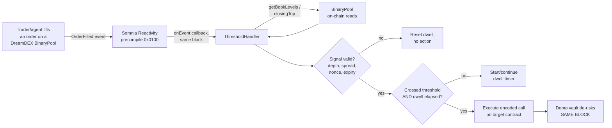

# 00 — Project Overview

## What Threshold is

**Threshold is a probabilistic automation layer for DreamDEX Event Contracts.**

One sentence: *Threshold lets a smart contract execute an action when the market's capital-backed belief that something will happen crosses a threshold and holds there — not after the event has already occurred.*

## The problem

Every automation primitive on-chain today fires on a **fact that has already happened**:

- Chainlink Automation / Gelato: a keeper polls a condition and submits a tx when it is already true.
- Liquidation engines: fire when the health factor has *already* breached.
- Price-triggered stops: fire when the price has *already* crossed.

By the time these fire, the loss is taken. Acting on *expectation* requires either:

1. An off-chain model, which no contract can verify and whose operator has no downside for being wrong, or
2. A human watching a chart.

There is no on-chain primitive for "act because this is *likely*."

## Why Event Contracts are different

A DreamDEX binary Event Contract emits a signal with three properties that no oracle, model, or API has simultaneously:

| Property | Oracle | Model / API | Event Contract |
|---|---|---|---|
| Backed by capital (costly to be wrong) | No | No | **Yes** |
| Forward-looking (exists before the fact) | No | Yes | **Yes** |
| Settles on-chain, punishing error automatically | Partial | No | **Yes** |

The mid price of a binary market **is** a probability, bounded in `[0, 1]`, refreshed continuously by adversaries who lose money for mispricing it, and readable by any contract.

Threshold treats it as a **sensor**, not a betting venue.

## Core mechanism

## Target users

1. **DeFi protocol operators** — pause a market, raise collateral factors, or halt minting when the market prices a depeg/outage as likely.
2. **DAO treasuries** — de-risk a position when drawdown probability crosses a threshold.
3. **Vault managers** — rotate strategy allocation on expectation rather than realized loss.
4. **Smart-contract developers** — a general primitive: *any* contract call, gated on a market belief.

## Example use cases

- Withdraw treasury from a vault when P(BTC drops through strike this window) > 0.70 for 30s.
- Pause a lending market when P(oracle stalls) crosses.
- Reduce leverage when the market's implied volatility proxy (spread + probability) widens.

## What the MVP actually does

1. User connects a wallet on Somnia Shannon testnet.
2. Browses live DreamDEX binary Event Contract markets.
3. Sees a live, on-chain-derived probability with depth and spread.
4. Configures a trigger: threshold, direction, dwell seconds, minimum depth, max spread.
5. Selects an action — MVP ships a **DemoVault** with `derisk()`, plus a raw `(target, selector, calldata)` advanced mode.
6. Arms the trigger (one transaction).
7. A Reactivity subscription on that pool's `OrderFilled` invokes the handler on every fill.
8. When the validated probability crosses and holds, the handler executes the action **in the same block as the fill that qualified it**.
9. UI shows the fill tx and the action's state change sharing a block number.

## What is deliberately NOT being built

- No trading bot, no strategy, no alpha. Threshold does not take positions.
- No market creation, no venue creation, no operator registration. (See `02` — that path is unverified and is not on the critical path.)
- No mainnet deployment. Testnet only, per submission rules.
- No off-chain keeper, ever. If it needs a keeper, the product's claim is false.
- No custom oracle. Resolution is DreamDEX's problem, not ours.
- No AI agent in the product. Agents are the *signal producers* (see `15`); building one is out of scope.

## Definition of success

The demo shows a fill transaction and an unrelated contract's state change **at the same block number**, with no transaction sent to that contract by any user or bot, and the manipulation guard visibly rejecting a single thin-book fill.

If that is on video, the project has succeeded. Everything else is polish.
