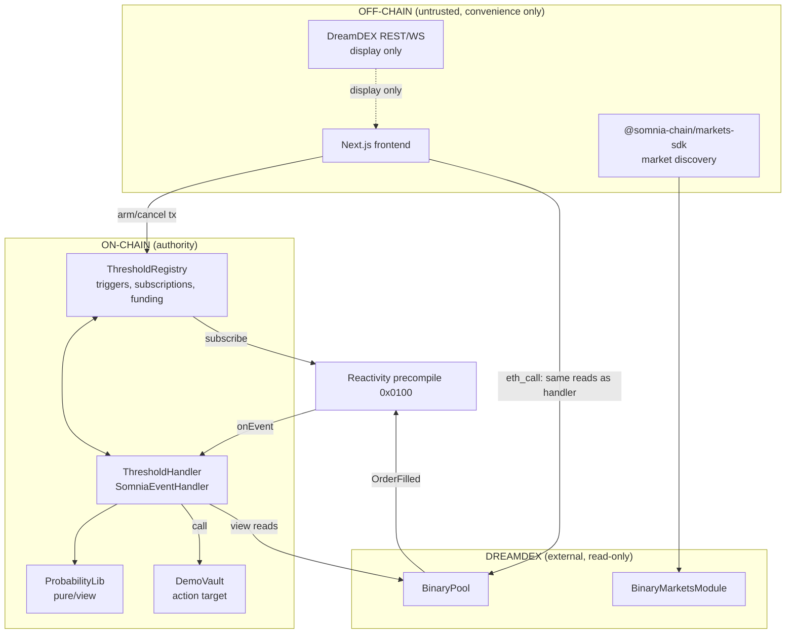

# 03 — Architecture

## System diagram

## On-chain components

| Contract | Responsibility |
|---|---|
| **ThresholdRegistry** | Trigger CRUD, ownership, action allow-listing, pool→subscription mapping, subscription funding, emergency stop |
| **ThresholdHandler** | `SomniaEventHandler` subclass. Receives callbacks, evaluates, advances state, dispatches actions |
| **ProbabilityLib** | `library`, pure/view. VWAP, bps conversion, gate evaluation. Unit-testable in isolation |
| **DemoVault** | Demo action target. `deposit()`, `derisk()`, `balance()`. Only `ThresholdHandler` may `derisk()` |
| **IBinaryPool** | Minimal interface: `getBookLevels`, `closingTop`, `getBinaryPoolParams`, `marketNonce`, `finalized`, `booksEmpty`, `marketExpiryNs` |

**Registry and Handler are separate contracts** for one reason: the handler's `onEvent` is
precompile-callable and must be as small and as unable-to-brick-state as possible. The registry holds
value and permissions. `NEEDS VERIFICATION` — if the 32 STT balance requirement applies to the
*calling* contract at `subscribe()` time, the **Registry** is the subscriber and must hold the balance.
Confirm which contract calls `SomniaExtensions.subscribe` and fund that one.

## Off-chain components

| Component | Required? | Why |
|---|---|---|
| Next.js frontend | **Yes** | 20% of the score is UX. No way around it |
| Market discovery via SDK | **Yes** | Enumerating live markets from raw chain reads is impractical; `client.listBinaryMarkets` exists |
| Backend / DB / indexer | **No** | See `10`. Everything needed is on-chain or in the SDK. Do not build one |
| `ec-maker` bot | **Demo only** | Provides a live two-sided book during recording. Not part of the product |

## Trust classification

### CRITICAL — correctness depends entirely on these
- `ThresholdHandler._onEvent` evaluation path
- `ProbabilityLib` VWAP and gate logic
- Gate G2 (`marketNonce` pinning) — without it, triggers fire on the wrong market
- Reactivity precompile authorization in `SomniaEventHandler`

### TRUSTED — assumed correct, not verified by us
- DreamDEX BinaryPool view functions return honest book state
- Somnia Reactivity delivers callbacks for matching events
- The market's price is not being manipulated by an actor willing to burn real capital across depth

### UNTRUSTED — must never influence execution
- The frontend, entirely
- DreamDEX REST / WebSocket indexer (**lags chain by seconds**)
- `fillPrice` from the event payload
- Any user-supplied value except through validated trigger config

### OPTIONAL
- Scheduled dwell-expiry subscription (degrades to fill-driven)
- Advanced raw-calldata action mode (demo works with `DemoVault` alone)

## The invariant that defines the architecture

> **No off-chain component can cause a trigger to execute, and no off-chain component can prevent a
> trigger from executing.**

The frontend computes probability *only* so the user sees the same number the handler will. If they
ever disagree, the handler is right and the UI has a bug. Concretely: the frontend must call the same
`getBookLevels` / `closingTop` / `getBinaryPoolParams` via `eth_call` and run a TypeScript port of
`ProbabilityLib`. **It must not** read probability from the REST indexer. Sharing the algorithm across
the boundary is a deliberate duplication; it is cheaper than the class of bug it prevents.

## Data flow — arming a trigger

1. Frontend: `listBinaryMarkets({ venueId, status: "Trading" })` → market rows with pool addresses
2. Frontend: `eth_call` pool reads → live probability, depth, spread
3. User configures; frontend previews validity against current book
4. `registry.createTrigger(...)` — registry reads `marketNonce()` and **pins it**
5. Registry subscribes to the pool if no subscription exists
6. Trigger is `ARMED`

## Data flow — firing

1. Any trader fills an order on that pool → `OrderFilled`
2. Precompile invokes `handler.onEvent(pool, topics, data)`
3. Handler: for each trigger on `pool` → gates G1–G8 → depth-weighted probability
4. Qualified + dwell satisfied → `target.call{gas: cap}(calldata)` inside `try/catch`
5. Emit `TriggerExecuted(triggerId, probabilityBps, blockNumber, success)`
6. Frontend watches for the event and displays both block numbers
