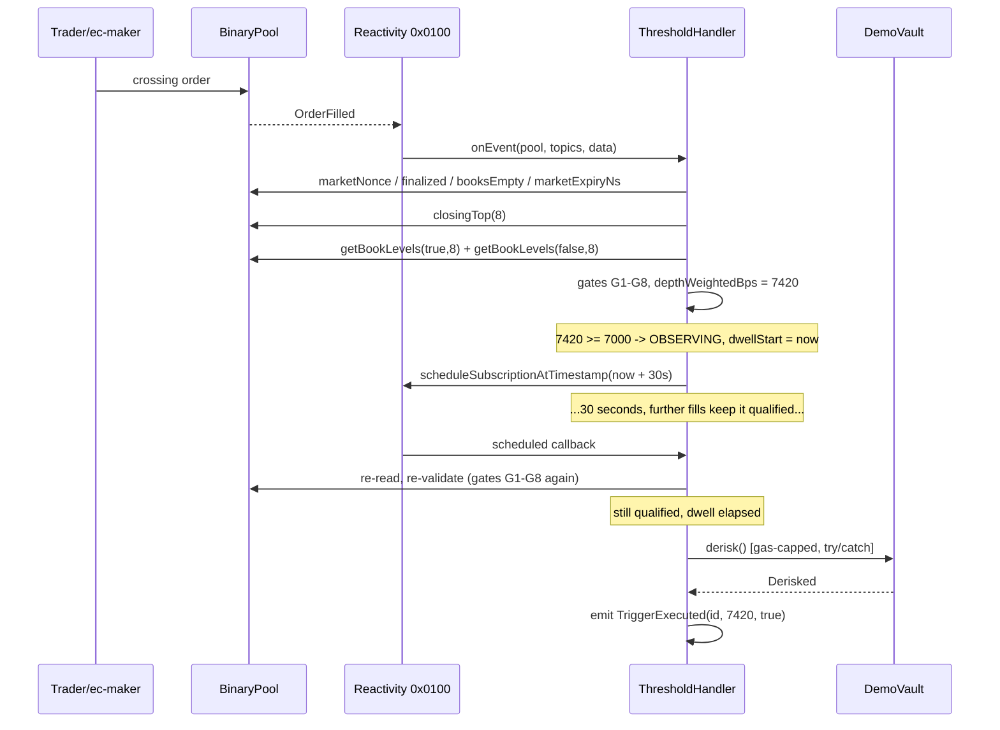

# 08 — Trigger Engine (state machine)

## States

| State | Meaning |
|---|---|
| `NONE` | Does not exist |
| `ARMED` | Live, subscription active, probability not currently qualifying |
| `OBSERVING` | Qualifying; dwell timer running |
| `EXECUTED` | One-shot trigger fired successfully. Terminal |
| `EXPIRED` | Market resolved/expired, or pool recycled (nonce mismatch). Terminal |
| `CANCELLED` | Owner cancelled. Terminal |
| `FAILED` | Action call reverted on a one-shot trigger. Terminal |

## Transition table

| From | Event | Condition | To | Side effects |
|---|---|---|---|---|
| `NONE` | `createTrigger` | validations pass | `ARMED` | pin `marketNonce`; subscribe pool if first |
| `ARMED` | callback | gates fail | `ARMED` | none |
| `ARMED` | callback | gates pass, not qualified | `ARMED` | none |
| `ARMED` | callback | gates pass, qualified | `OBSERVING` | `dwellStart = now`; schedule dwell-expiry callback |
| `OBSERVING` | callback | gates fail **or** not qualified | `ARMED` | `dwellStart = 0` (**dwell reset**) |
| `OBSERVING` | callback | qualified, `now - dwellStart < dwellSec` | `OBSERVING` | none |
| `OBSERVING` | callback | qualified, dwell elapsed, one-shot | `EXECUTED` | dispatch action |
| `OBSERVING` | callback | qualified, dwell elapsed, recurring, cooldown clear | `ARMED` | dispatch; `lastExecutedAt = now`; `dwellStart = 0` |
| `OBSERVING` | callback | qualified, dwell elapsed, recurring, cooling down | `OBSERVING` | none |
| `ARMED`/`OBSERVING` | callback | `marketNonce != pinnedNonce` | `EXPIRED` | unsubscribe if last on pool |
| `ARMED`/`OBSERVING` | callback | `finalized()` or past `marketExpiryNs` | `EXPIRED` | as above |
| `ARMED`/`OBSERVING` | callback | dispatch reverted, one-shot | `FAILED` | record `success=false` |
| `ARMED`/`OBSERVING` | `cancelTrigger` | `msg.sender == owner` | `CANCELLED` | unsubscribe if last on pool |
| any terminal | anything | — | unchanged | ignored silently |

## Sequence — the happy path



## Design decisions and their reasons

**Dwell resets rather than pauses.** A trigger that accumulates dwell across disqualifying gaps would
fire on a probability that only qualified intermittently — exactly the manipulation the dwell exists
to prevent. Reset is strictly safer and simpler to reason about.

**Gates are re-evaluated at execution time, not just at dwell start.** Between crossing and dwell
expiry the book may thin out. Executing on a stale qualification is the single most likely
correctness bug in this design. Re-validate immediately before dispatch, always.

**Nonce mismatch is `EXPIRED`, not an error.** The pool was legitimately recycled onto a new market.
The user's trigger referred to a market that no longer exists. Marking it `EXPIRED` and unsubscribing
is the honest outcome; silently re-pointing it at the new market would be a severe bug.

**One-shot is the default.** `recurring` requires an explicit opt-in plus a `cooldownSec`. A
recurring trigger with zero cooldown on a volatile market drains the subscription balance in minutes.
UI must enforce `cooldownSec >= dwellSec`.

**Terminal states are terminal.** No resurrection. A user who wants the trigger again creates a new
one — which re-pins the nonce, which is what they actually want.

## Idempotency

The scheduled dwell-expiry callback and an `OrderFilled` callback can land in the same block. Both
paths read the trigger's state first and both write state before dispatching. Because
`EXECUTED`/`FAILED` are terminal and checked at entry, the second call is a no-op.

**Acceptance test (12/A6):** deliver two callbacks in one block for a qualified trigger; assert
exactly one `TriggerExecuted` and exactly one `Derisked`.

## Failure isolation

The per-pool loop wraps each trigger evaluation:

```solidity
try this.evaluateExternal(id, snap) { }
catch { emit TriggerEvaluationFailed(id); }
```

One malformed trigger must never prevent the other fifteen on that pool from evaluating. This
requires `evaluateExternal` to be `external` and `onlySelf` — a small cost for real isolation.
